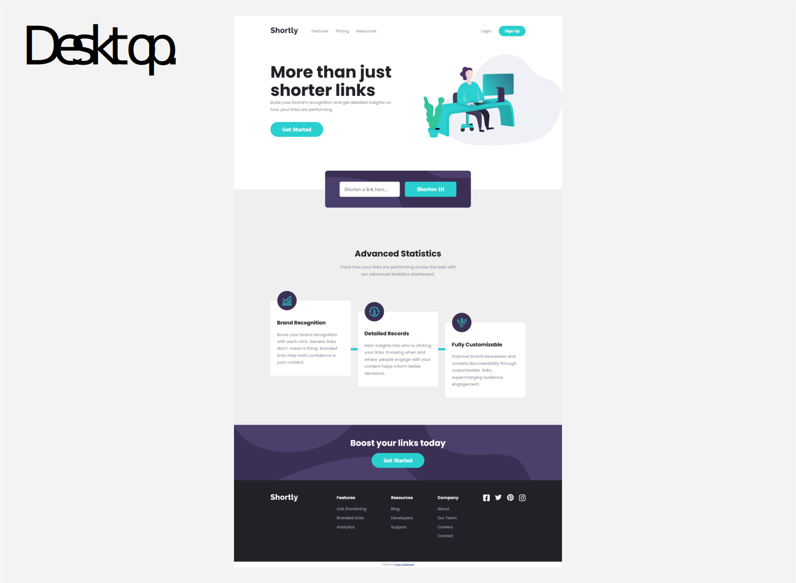

# Shortly URL shortening API solution

This is a solution to the [Shortly URL shortening API Challenge challenge on Frontend Mentor](https://www.frontendmentor.io/challenges/url-shortening-api-landing-page-2ce3ob-G).

## Table of contents

- [Overview](#overview)
  - [The challenge](#the-challenge)
  - [Screenshot](#screenshot)
  - [Links](#links)
- [My process](#my-process)
  - [Built with](#built-with)
  - [Continued development](#continued-development)
  - [Useful resources](#useful-resources)
- [Author](#author)
- [Acknowledgments](#acknowledgments)

## Overview

### The challenge

Users should be able to:

- View the optimal layout for the site depending on their device's screen size
- Shorten any valid URL
- See a list of their shortened links, even after refreshing the browser
- Copy the shortened link to their clipboard in a single click
- Receive an error message when the `form` is submitted if:
  - The `input` field is empty

### Screenshot

### Links

- Solution URL: [https://github.com/hugodelbegue/url-shortening-api-master](https://github.com/hugodelbegue/url-shortening-api-master)
- Live Site URL: [https://hugodelbegue.github.io/url-shortening-api-master/](https://hugodelbegue.github.io/url-shortening-api-master/)

## My process

### Built with

- Semantic HTML5 markup
- CSS custom properties
- Flexbox
- CSS media querie
- Responsive
- Mobile-first workflow
- Templates Vue
- [Google Fonts](https://fonts.google.com/) - Fonts imports for typography
- [Sass](https://sass-lang.com/) - CSS language preprocessor
- [Vite.js](https://vitejs.dev/) - Vue framework

### Continued development

I will continue to practice different training projects.

### Useful resources

- [Google](https://www.google.com/) - Google search engine.
- [W3 Schools](https://www.w3schools.com/) - Library of Html, CSS and Javascript resources.
- [Developer mozilla](https://developer.mozilla.org/fr/) - Resources for Html CSS and Javascript. Here you will find all the necessary documentation for the methods to be used.
- [Vite.js Documentation](https://vitejs.dev/guide/) - Vite documentation.
- [Vue.js Documentation](https://vuejs.org/guide/introduction.html) - This is an amazing article which helped me finally understand XYZ. I'd recommend it to anyone still learning this concept.

## Author

- Portfolio - [hugodelbegue.fr](https://hugodelbegue.fr/)
- Frontend Mentor - [@hugodelbegue](https://www.frontendmentor.io/profile/HUGODELBEGUE)
- GitHub - [hugodelbegue](https://github.com/hugodelbegue)

## Acknowledgments

Youtube tutorials:

- Youtube [https://www.youtube.com//](https://www.youtube.com/)

Online training:

- Codecademy [https://www.codecademy.com/](https://www.codecademy.com/)
